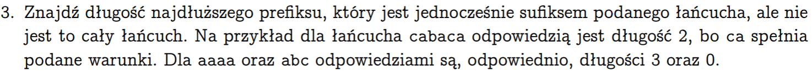

# 🔤 Longest Prefix-Suffix Solver

This repository contains two alternative Python implementations designed to solve the **Longest Prefix-Suffix (LPS)** problem. The project explores both the highly efficient, linear-time Knuth-Morris-Pratt (KMP) prefix function and advanced Suffix Tree structures to find the longest proper prefix of a string that is also its suffix.

---

## 🚀 Features

- **Dual Approach:** Solve the exact same problem using two completely different algorithmic methodologies.
- **Stream-Ready:** Input handling is fully compatible with standard input (`stdin`) redirection, making it perfect for automated grading platforms.
- **Clean Code:** Clean, modular Python implementation with error handling for empty inputs.

---

## 🛠️ Tech Stack

- Python - core programming language.
- suffix-trees - external Python library used for building and navigating the Suffix Tree structure.

---

## 📊 Algorithm Complexity

Both approaches have $O(n)$ Time Complexity and $O(n)$ Space Complexity.

---

## 💻 How to Run

### 🔧 Prerequisites

Before running the Suffix Tree solution, you need to install the required library. Run the following command in your terminal:

`bash pip install suffix-trees ` or `bash python -m pip install suffix-trees `

(No additional installation is required for the KMP version).

---

### 🏃 Running the Scripts

Both programs accept data via standard input (stdin). Use your terminal of choice to inject the input.txt file into the scripts:

- On Linux / macOS / Windows CMD:

```bash
# Run KMP version
python solution_kmp.py < input.txt

# Run Suffix Tree version
python solution_suffix_tree.py < input.txt
```

- On Windows PowerShell:

```bash
# Run KMP version
cat input.txt | python solution_kmp.py

# Run Suffix Tree version
cat input.txt | python solution_suffix_tree.py
```

---

## 📋 Problem Description

Below is the original task statement provided in Polish language during the uni assignment:


